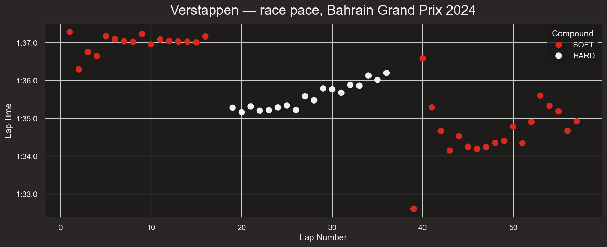
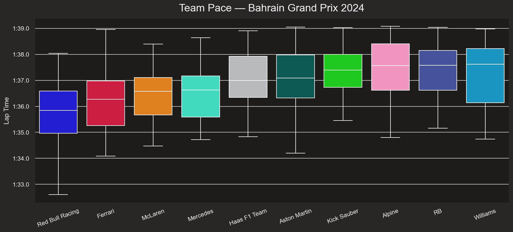
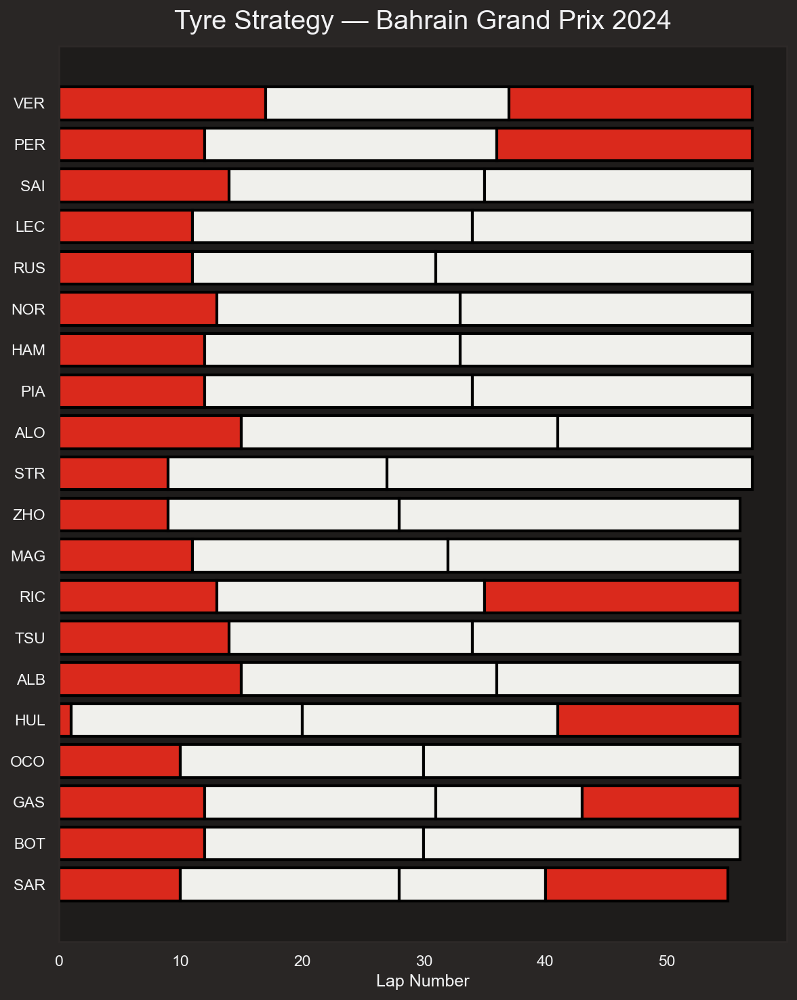
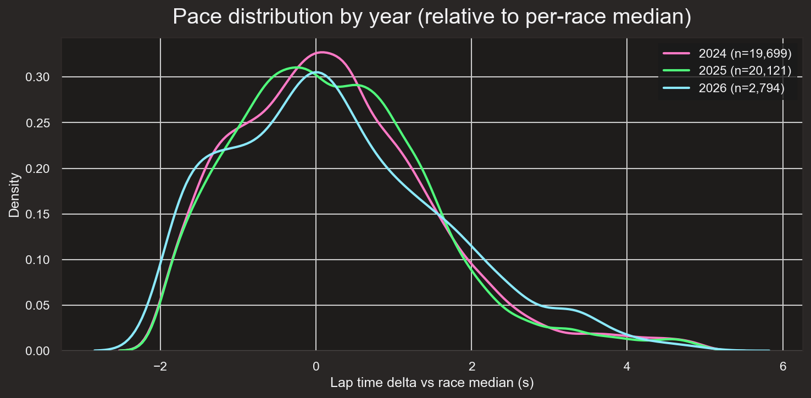
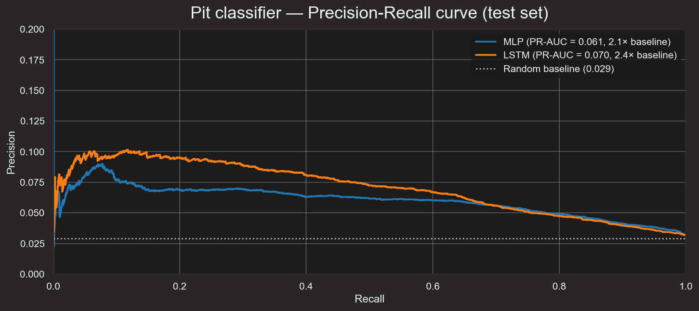
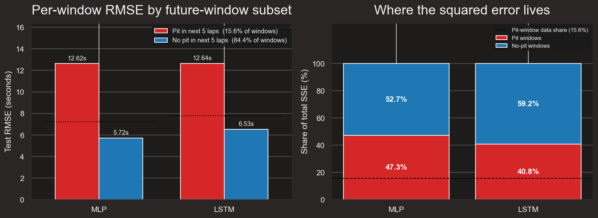
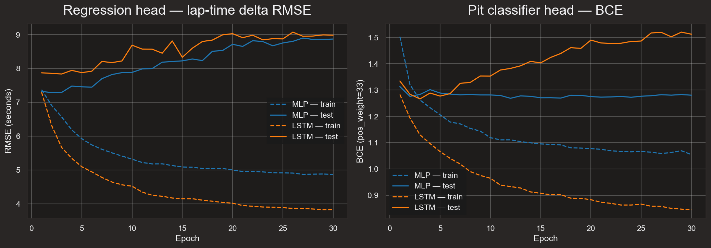
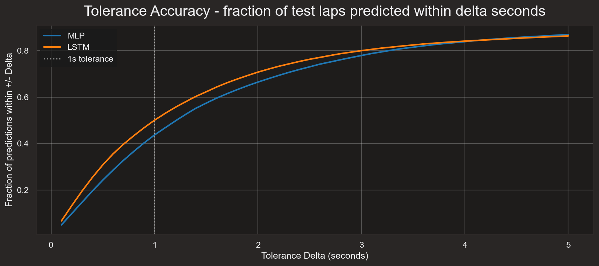
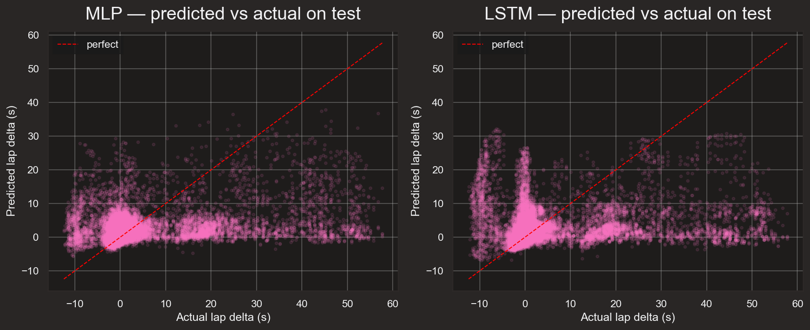

## Abstract
This project extends prior work on Formula 1 lap-time forecasting by training the model to anticipate pit-stop laps directly, rather than treating them as unpredictable noise. The previous version trained an MLP and an LSTM to predict the next five lap-time deltas from a window of the past ten laps, and converged to a test RMSE of roughly 7.3 seconds for both architectures. Diagnostic work showed this ceiling was driven almost entirely by pit-stop laps (+20 to +30 second deltas) which past lap times cannot anticipate. The current version adds two extensions on the same MLP and LSTM backbones. First, a parallel classification head predicts the probability of a pit-in on each of the next five laps, trained jointly with the regression head via a combined MSE + weighted BCE loss. Second, eight new pit-aware input features are added — including per-circuit pit priors and a previous-stint-length feature — to encode strategic information that past lap times do not carry. The two extensions trade a small amount of regression accuracy for a useful pit-stop probability output, with the MLP recovering most of that cost after the new features are added; the LSTM is sensitive to the larger input dimension at our seed and regresses, which we attribute to optimization noise rather than the features themselves. The structural ceiling around 7.3 seconds test RMSE remains, but the model now produces a calibrated pit signal as a side output, and the diagnostic plots motivate a follow-up project using a Transformer architecture with explicit per-stint attention.

## Introduction
Formula 1 races last between one and a half and two hours, with the number of laps ranging from 44 to 78. There are eleven teams on the grid in the 2026 season; in 2024–2025 there were ten — Audi replaced Sauber for 2026 and Cadillac is a brand-new team. Lap times can vary greatly due to tyre wear, fuel load, traffic, weather, and pit-stops. Pit-stops introduce by far the most variation, as teams time them strategically to maximize their drivers' track position.

The previous version of this project — *F1 Lap Time Forecasting* — trained MLP and LSTM models to predict the next five lap-time deltas from a window of ten past laps as a sequence-to-sequence regression. Both architectures converged to similar test RMSE around 7.3 seconds (MLP best 7.26, LSTM best 7.33). The tolerance-accuracy curve and predicted-vs-actual plots showed the residual error was concentrated almost entirely on pit-stop laps, and the conclusion was that no amount of architectural tuning could fix a problem caused by missing information in the input window: pit-timing is a strategic team decision and ten laps of past lap times do not carry it.

This version makes the pit signal a first-class part of the model. The MLP and LSTM backbones gain a parallel classifier head that predicts pit-in probability on each of the next five laps, trained jointly with the regression head. The input feature set is widened with eight per-lap features that encode strategic context past lap times cannot — per-circuit pit-stop priors, current race progress, the length of the most recently completed stint, and four track-status flags from FastF1's race-control feed. The result is reported as a three-tier ablation: v1 baseline → v2 with the pit head only → v2 with the pit head and new features.

## Methods

### Data Collection
All race data was downloaded via the FastF1 Python package. Only race sessions were collected (no free practice, qualifying, or sprints) for the past three seasons (2024, 2025, 2026). Other sessions were excluded because their lap times are not under race conditions (different fuel loads, different driver objectives).

For each lap, the following were extracted: driver, team, lap number, stint number, raw lap time, sector times, tyre compound, tyre age, grid position, track-status flag, pit-in/pit-out times, and per-lap weather (air temperature, track temperature, humidity, atmospheric pressure, rainfall, wind speed, and wind direction). Telemetry data was available but not used, as it would drastically increase dataset size without adding clear predictive power at lap-level resolution. The raw dataset contained 57,366 lap rows across 52 race sessions.

### Data Cleaning
Three teams spanning the 2024–2026 seasons introduced complications:

- Kick Sauber (2024–2025) was rebranded as Audi for 2026.
- Cadillac is a brand-new team in 2026 with no historical data.
- RB was renamed to Racing Bulls in 2025, but it is still the same team.

Only the teams that competed across all three seasons were kept: Red Bull Racing, Ferrari, McLaren, Mercedes, Williams, Haas, Aston Martin, Alpine, and Racing Bulls. Audi/Kick Sauber and Cadillac rows were dropped; RB was renamed to Racing Bulls. This removed 5,904 lap rows, leaving 51,462.

### Target Variable
Raw lap time was not used as the target: track-specific baselines (Monaco's ~75-second laps vs. Spa's ~105-second laps) and regulation changes (2026 cars are slower) would force the model to memorize per-track and per-year offsets. Instead, lap time relative to the race's median pace was used:

LapTimeDelta_s = LapTime_s − RaceMedian_s

The race median was computed from a clean subset of laps (not pit-in/out, green flag, non-null lap time). Pit laps appear as large positive deltas (+20 to +30 seconds) and fastest laps as small negative deltas.

### Outlier Cleaning
After computing the delta target, two further cleaning steps were applied:

- 562 rows had no valid delta (their race had no clean baseline laps) and were dropped.
- 70 rows had |delta| > 60 seconds, indicating data corruption (red-flag periods where the lap timer kept running) and were dropped.

Pit-stop laps were not dropped — they are real racing-condition laps the model should learn to predict. The final cleaned dataset contained 50,830 lap rows.

### Pit-Aware Features
Eight new per-lap features were added on top of the original 29 input columns:

- **LapsRemaining.** Laps until the end of the race (`max_lap_in_race − current_lap`). Encodes race progress, which interacts strongly with pit-window timing.
- **CircuitFirstStopLap.** Per-event mean lap of first pit, computed over training races only and broadcast to test races by event name. Encodes "early-stop circuits" (e.g., Monaco) versus "late-stop circuits" (e.g., Spa). Test events not present in the training-side priors fall back to the overall training mean.
- **CircuitAvgStops.** Per-event mean total stop count per driver-race, train-only, with the same fallback. Distinguishes one-stop and two-stop tracks.
- **PrevStintLength.** Length in laps of the most recently completed stint, computed per (Year, Round, Driver) using only that driver's own past laps. Zero for laps still in the opening stint. Captures strategy history that the current-state features (`Stint`, `TyreLife`) do not — specifically, whether the driver just finished a long stint (more likely to pit again if tyres are aged) or a short one (atypical strategy in play).
- **TS_Yellow, TS_SC, TS_Red, TS_VSC.** Four multi-hot flags parsed from FastF1's `TrackStatus` digit-string. Indicate yellow flag, full safety car, red flag, and virtual safety car respectively. Teams pit opportunistically under SC/VSC, so these flags are direct signals of pit-window opportunities.

All three of the pit-strategy aggregates (`CircuitFirstStopLap`, `CircuitAvgStops`, `PrevStintLength`) are leakage-safe: the circuit priors aggregate many races per event using only the training side, and `PrevStintLength` is a per-driver-race cumulative that never crosses race boundaries.

### Feature Encoding and Normalization
The 17 raw columns were transformed into 37 numeric per-lap features:

- **Numerics (12):** LapTimeDelta_s, TyreLife, Position, Stint, LapsRemaining, CircuitFirstStopLap, CircuitAvgStops, PrevStintLength, AirTemp, TrackTemp, Humidity, WindSpeed. The eleven non-target numerics were standardized to $\mu=0, \sigma=1$ using train-set statistics.
- **Booleans (8):** IsPitInLap, IsPitOutLap, FreshTyre, Rainfall, TS_Yellow, TS_SC, TS_Red, TS_VSC, cast to 0.0 / 1.0.
- **One-hot categoricals (17):** tyre compound (5: SOFT/MEDIUM/HARD/INTERMEDIATE/WET), team (9), year (3: 2024/2025/2026).

### Train/Test Split
The 52 races were split 75/25 by race (39 training races, 13 test races). The split was performed at the race level — not the lap level — so that no (year, race, driver) sequence appears in both train and test, which would inflate test performance.

### Windowed Dataset
A sliding-window dataset, `LapWindowDataset`, was constructed per (year, round, driver) sequence. Each window has a lookback of ten laps and a horizon of five laps. Windows never span across races or drivers, producing 28,254 training and 10,076 test windows. Each window yields three tensors: an input `X` of shape (10, 37); a regression target of shape (5,) — the next five `LapTimeDelta_s` values; and a pit target of shape (5,) — the next five `IsPitInLap` flags. The pit base rate across all training windows is 2.99% per future lap; 14.3% of training windows contain at least one pit.

### Model Architectures
Both backbones from the previous version are reused, modified only to add a second output head.

**MLP (28,554 parameters).** Flattens the (10, 37) input to a 370-vector, passes through two hidden layers of 64 units with ReLU and dropout (p=0.2), then splits into a regression head (Linear 64→5) and a pit-classifier head (Linear 64→5, logits). Linear weights initialized with He/Kaiming normal; biases zero.

**LSTM (86,794 parameters).** Single-layer LSTM with hidden dimension 128, processing the (10, 37) input. The final hidden state passes through a dropout layer (p=0.3) and then into the same two parallel heads (regression and pit). LSTM weights initialized with Xavier/Glorot uniform; biases zero.

### Training
Both models were trained with identical optimization settings:

- **Loss:** $L = \text{MSE}(\hat{\delta}, \delta) + \lambda \cdot \text{BCEWithLogits}(\hat{p}, p; w^+)$, where $\hat{\delta}$ is the predicted delta vector, $\hat{p}$ the pit logits, and $w^+$ a positive-class weight inside BCE to compensate for class imbalance.
- **Pit-class positive weight:** $w^+ = 33$, chosen to approximately match $1/\text{base rate}$.
- **Pit-loss weight:** $\lambda = 1.0$. A brief sweep over $\lambda \in \{1, 10, 35\}$ on both architectures did not show a strictly dominant choice; $\lambda = 1$ was retained as the most conservative trade against the regression objective.
- **Optimizer:** Adam, learning rate = 0.001.
- **Weight decay:** L2 regularization with $\lambda_{wd} = 10^{-4}$.
- **LR schedule:** StepLR with step size = 10, $\gamma = 0.5$.
- **Batch size:** 128. **Epochs:** 30.
- **Checkpoint selection:** the combined criterion $\text{test\_RMSE} + \lambda \cdot \text{test\_BCE}$ is minimized; the best-epoch weights are restored before evaluation.

## Results and Discussion

### Exploratory Data Analysis
The exploratory plots are unchanged from the previous version and still motivate the same conclusions: pace varies by tyre stint, by team, and by circuit, but is broadly stable across seasons.

#### Race pace by tyre compound (Verstappen, Bahrain 2024)

- Three distinct stints are visible.
- Lap times increase as tyres degrade.

#### Team pace distribution (Bahrain 2024)

- Red Bull Racing has the lowest median lap time.
- Wide interquartile range (different drivers within the same team).
- Each team has a distinct pace.

#### Tyre strategy

- Different pit stops for each driver.
- Hülkenberg made four stops after a first-lap incident.
- Pit timing is sometimes unplanned.

#### Pace distribution by season

- All three seasons share a similar distribution of lap-time deltas.
- The model does not need to learn the regulation differences between seasons.

### Ablation Results
Three configurations are compared on the same train/test split. The pit head and pit-aware features are introduced one at a time so that their contributions can be read independently.

| Configuration            | MLP best test RMSE | LSTM best test RMSE | MLP params | LSTM params |
|--------------------------|--------------------|---------------------|-----------:|------------:|
| v1 (single regression head, 29 features) | **7.26**           | **7.33**            | 23,109     | 82,053      |
| v2a: + pit head (29 features)            | 7.32               | 7.43                | 23,434     | 82,698      |
| v2b: + pit-aware features (37 features)  | **7.29**           | 7.84                | 28,554     | 86,794      |

Pit-classifier metrics for the v2b row (final test set):

| Model | Test BCE | Test pit PR-AUC | Pit base rate |
|-------|---------:|----------------:|--------------:|
| MLP   | 1.276    | 0.061           | 0.029         |
| LSTM  | 1.267    | 0.070           | 0.029         |

**Reading the table.** Going from v1 to v2a, both backbones lose roughly 0.06–0.10 seconds of best test RMSE when the pit-classifier head is added. This is the expected cost of using shared body capacity for two objectives: the regression head now competes with the BCE head for the same hidden representation. The pit head is small (325 parameters in the MLP, 645 in the LSTM) and the loss weights are balanced so this trade is intentional.

Going from v2a to v2b, the MLP improves (7.32 → 7.29), recovering most of the v2a regression and returning to within noise of the v1 single-head baseline despite carrying a dual-objective loss. The LSTM, by contrast, regresses substantially (7.43 → 7.84) at our random seed. The two reruns of the same configuration produced bit-identical results (the seed is set before model instantiation), so this is not run-to-run dropout jitter; it is the LSTM's optimization trajectory at this particular seed reacting badly to the larger input dimension. Single-seed LSTM runs are not a reliable measurement of a feature's true effect — we attribute this to optimization noise rather than the features themselves, and a multi-seed sweep is the appropriate way to test it.

The pit-classifier head reaches a PR-AUC of roughly 2× the base rate on both backbones — modest but non-trivial given that the base rate is 2.9% per future lap. The BCE numbers on both models are at or below the v2a level despite the wider input, which suggests the new features help the pit head specifically even when they do not help (or hurt) the regression head.

### Pit-Classifier Performance

- Both models score well above the base-rate floor on the precision–recall curve.
- Useful as a downstream signal even with modest PR-AUC.

### Error Decomposition

- Pit-stop laps remain the dominant contributor to the squared-error budget.
- v2b reduces the pit-error contribution relative to v1 but does not eliminate it.
- The remaining headroom requires representing race state beyond a fixed 10-lap window.

### Model Training Curves

- Both models reach their best test checkpoint very early (epoch 2 for the MLP, epoch 3 for the LSTM).
- Training loss continues to drop while test loss diverges — the same overfitting pattern observed in the previous version, now accompanied by a BCE term whose minimum tracks the RMSE minimum closely.

### Tolerance Accuracy

- Roughly half of all per-lap predictions fall within a one-second tolerance.
- The asymptote near 85–90% reflects the unpredictable pit-stop laps in the prediction horizon.

### Predicted vs Actual

- Both models still cluster predictions near delta = 0.
- Pit-stop ground truth (+20 to +30 s) remains under-predicted, even with the auxiliary pit head reducing structural BCE.

## Conclusions
Adding a pit-classifier head and a small set of pit-aware features to the same MLP and LSTM backbones from the previous version produces a model that returns a useful pit-in probability for each of the next five laps, at a cost of a few hundredths of a second in best test RMSE on the regression head. After both extensions are layered in, the MLP returns to within noise of its single-head baseline (7.26 → 7.29) while gaining the pit output; the LSTM is more sensitive to the wider input, regressing on this seed (7.33 → 7.84), and a multi-seed sweep would be needed to characterize the true effect rather than the seed-specific optimization trajectory.

The structural ceiling around 7.3 seconds test RMSE that motivated this work is not broken by either extension. The error decomposition confirms why: pit-stop laps still dominate the squared-error budget, and a fixed 10-lap input window cannot represent the strategic race state — prior stints, pit count, compounds already used — that determines when the next pit will happen. The pit head learns the *probability* of a pit but cannot resolve its *exact timing* from the same restricted view.

### Possible Extensions
- **Per-stint attention.** A Transformer encoder whose input is two-scale — the recent lap window plus a small number of summary tokens, one per completed stint — could attend to the strategic race state directly. This is the most natural next step and is being pursued as a separate project.
- **Multi-seed evaluation.** A modest sweep across five seeds would convert single-point comparisons (especially the LSTM regression observed here) into mean ± std error bars and is the appropriate way to claim a feature does or does not help.
- **Driver-level cross-attention.** Attending to teammate and competitor laps within the same race would expose information about pit timing that a per-driver view cannot.

## References
- FastF1 — Python package used for data download
  - Years used: 2024–2026 (races only; no FP, qualifying, or sprints)
  - https://docs.fastf1.dev/index.html
- FastF1 — styling conventions for plots
  - https://docs.fastf1.dev/gen_modules/examples_gallery/index.html
- F1 Lap Time Forecasting (v1, predecessor project)
  - https://github.com/JarodDeFilippo/F1-Lap-Time-Forecasting
